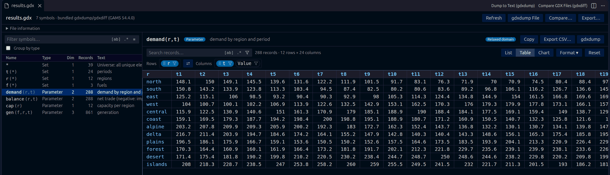
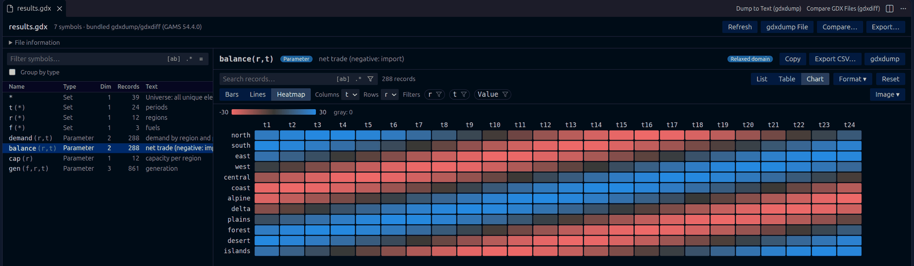
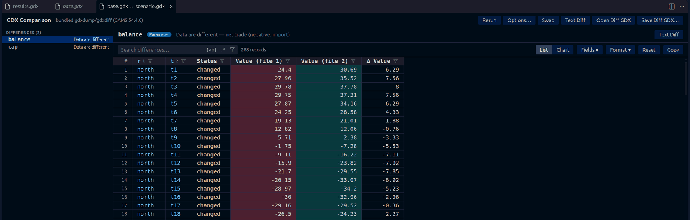

# GDX Analyzer

Browse, chart and compare [GAMS](https://www.gams.com) GDX files in Visual Studio Code.

GDX Analyzer opens `.gdx` files in a fast, read-only viewer, compares files with gdxdiff, exports to Excel and
gives AI agents read-only access to model data and solutions. `gdxdump` and `gdxdiff` are included for
Windows, macOS and Linux, so no GAMS installation is needed.

> GDX Analyzer is an independent project by Muhammet Soyturk. It is not affiliated with or endorsed by GAMS.

## Features

### Viewer

- **Symbol table** with entry, name, domain, type (e.g. *Positive Variable*, *Singleton Set*), dimension, records
  and explanatory text. Sort by any column, group by type, and search names or all columns. Entry `*` lists the
  unique elements of the file.
- **List and table views.** The table view arranges dimensions as rows and columns: drag them between the two, or
  swap them with ⇄. Variables and equations show level, marginal, bounds and scale.
- **Built for large symbols.** Records load while you scroll, so symbols with millions of records stay responsive.
- **Filters and search.** Filter labels from a checklist and numbers by range and special value. Search with
  wildcards, exact match or regular expressions, then jump between matches or show only matching rows.
- **Exact numbers.** Values are read exactly. Choose the format per symbol (`g`, `f` or `e`, a precision, or full
  precision); sorting, filters and copies always use the exact values.
- **Selection and copy.** Select cells, rows or columns and press Ctrl+C to paste them into Excel. The status bar
  shows the sum, average and count of the selection.
- **Remembers your view** of every symbol (filters, sorting, layout, format, column widths) and reloads when the
  file changes, e.g. after a GAMS run.

### Charts

Show the filtered records of a symbol as **bars**, **lines** or a **heatmap**. Pick the category dimension, the
series and the field; other dimensions are summed. Colors follow your theme and are colorblind-safe, and a
heatmap switches to a diverging scale when values have both signs. Save a chart as PNG or SVG, or copy it.

### Comparison

Compare two files with gdxdiff and review each differing symbol record by record: the values of both files, their
difference, and records that exist in only one file. Chart the differences, open a text diff of the gdxdump output,
or save the difference file. All gdxdiff options (tolerances, fields, symbols to compare or skip, and more) can be
set per comparison.

### Export

- **Excel:** write any symbols to an `.xlsx` workbook, one sheet each, laid out like their view, with exact values.
  Optionally apply the filters and choose how special values are written. The same export can be saved as GAMS
  Connect instructions.
- **CSV** of one symbol, and the **gdxdump output** of a file or symbol as a text document.

### AI agents (MCP)

A built-in [MCP](https://modelcontextprotocol.io) server gives AI agents read-only access to GDX files. It is
available to agent mode in VS Code automatically. For Claude Code, Cursor and other agents, run
**GDX: Copy MCP Server Configuration for AI Agents…** and paste the result into their configuration.

| Tool | Description |
| --- | --- |
| `gdx_list_symbols` | The symbols of a file with type, dimension, domain, records and text |
| `gdx_read_symbol` | Records as CSV with exact values; filters, search, sorting and paging |
| `gdx_symbol_stats` | Distinct labels per dimension; count, sum, mean, min, max and special values per field |
| `gdx_compare` | The differing symbols of two files, or the differing records of one symbol |

## Getting started

1. Install GDX Analyzer from the Visual Studio Marketplace.
2. Open a `.gdx` file: it opens in the viewer.
3. To compare two files, select both in the Explorer, right-click and choose **Compare GDX Files (gdxdiff)**.
   You can also use **Select for GDX Compare** and **Compare with Selected GDX**, or **Compare…** in the viewer.

## Commands

All commands are in the Command Palette under **GDX**; the most common ones are also in the Explorer context
menu and the viewer.

| Command | Description |
| --- | --- |
| Open in GDX Analyzer | Open a GDX file in the viewer |
| Compare GDX Files (gdxdiff) | Compare two GDX files |
| Export to Excel… | Export symbols to an Excel workbook |
| Export Symbol to CSV | Save the records of a symbol as CSV |
| Dump to Text / Dump Symbol to Text | Open the gdxdump output of a file or symbol |
| Select Encoding of Labels… | Read labels and texts in another encoding (e.g. Latin-1) |
| Reset Viewer State | Forget the saved view of a file |
| Copy MCP Server Configuration for AI Agents… | Connect external AI agents |
| Show Tool Information | Show which gdxdump and gdxdiff are used |

## Settings

| Setting | Default | Description |
| --- | --- | --- |
| `gdxAnalyzer.backend` | `auto` | Tools to use: `bundled`, `gams` (a GAMS installation) or `gamspy` (the GAMSPy CLI); `auto` prefers them in this order |
| `gdxAnalyzer.gamsSystemDirectory` | | GAMS system directory for the `gams` backend (found automatically otherwise) |
| `gdxAnalyzer.gamspyExecutable` | | `gamspy` executable for the `gamspy` backend (found automatically otherwise) |
| `gdxAnalyzer.encoding` | `utf-8` | Encoding of labels and texts, e.g. `windows-1252` |
| `gdxAnalyzer.numberFormat.*` | `g`, 6 digits | Default number format: style, precision, full precision, trailing zeros |
| `gdxAnalyzer.squeezeDefaults` | `false` | Hide variable and equation fields that have their default value in every record |
| `gdxAnalyzer.rememberViewState` | `true` | Remember the view of each file after it is closed |
| `gdxAnalyzer.copy.decimalSeparator` | `period` | Decimal separator of copied numbers: `period`, `system` or `custom` |
| `gdxAnalyzer.maxRowsPerPage` | `500` | Rows loaded at once while scrolling |
| `gdxAnalyzer.maxColumnsPerPage` | `100` | Columns per page in wide table views |
| `gdxAnalyzer.diff.*` | | Default gdxdiff options: tolerances, field, set texts, defaults, domains, UEL order |

## Requirements

- Visual Studio Code 1.101 or later.
- Windows (x64), macOS (Intel and Apple silicon) or Linux (x64 and arm64). On other platforms, GDX Analyzer uses a
  [GAMS](https://www.gams.com) installation or [GAMSPy](https://gamspy.readthedocs.io) (`pip install gamspy`).

## Performance

Records are kept in compact columns, and the viewer only renders the rows on screen. Measured on an Intel Core
i7-1260P with a 148 MB GDX file:

| Symbol | Load | Memory | Sort | Label search | Table view |
| --- | --- | --- | --- | --- | --- |
| 1 million records (2 dimensions) | 0.3 s | 22 MB | 0.3 s | 0.02 s | 0.07 s |
| 1 million variable records | 1.0 s | 58 MB | 0.3 s | 0.04 s | 0.07 s |
| 10 million records (3 dimensions) | 4.6 s | 250 MB | 5.2 s | 0.2 s | 0.6 s |

Comparing two files with 2 million differing records takes about 3 seconds.

## Limitations

- GDX files must be on a regular file system; virtual file systems (such as vscode.dev's) are not supported.
- With the `gamspy` backend, file names must end in lower-case `.gdx`.
- Copying is limited to 5 million cells, and the Excel export to Excel's sheet size (1,048,576 rows, 16,384
  columns). Filter larger symbols first.

## Contributing

See [CONTRIBUTING.md](CONTRIBUTING.md) for building, testing and packaging the extension, and
[THIRD_PARTY_NOTICES.md](THIRD_PARTY_NOTICES.md) for the licenses of bundled components.
