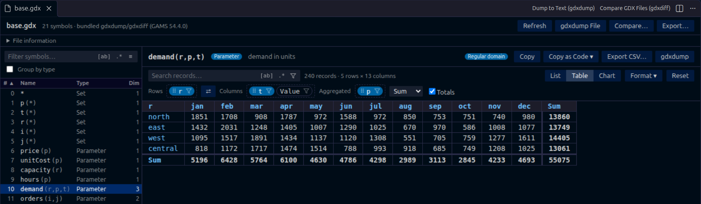
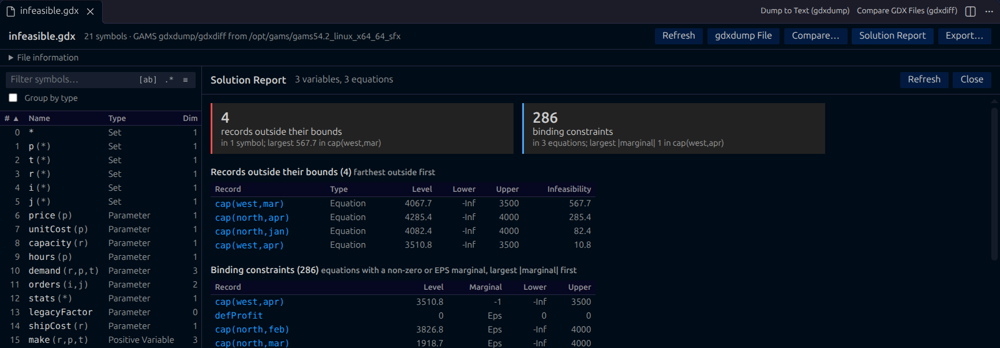
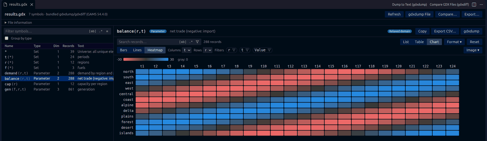
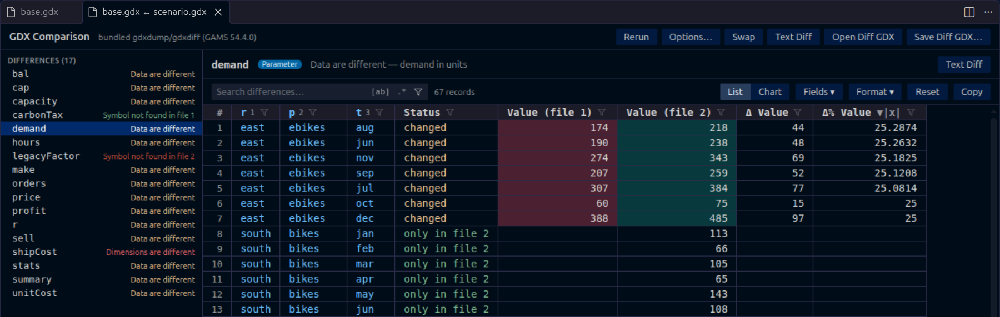
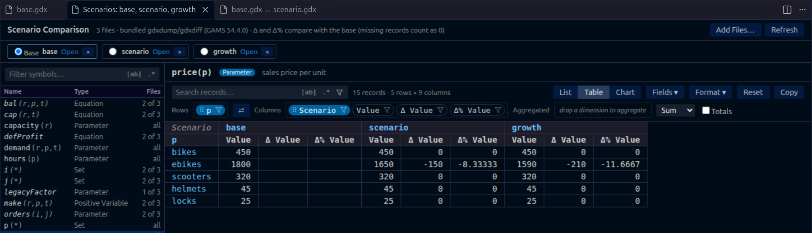
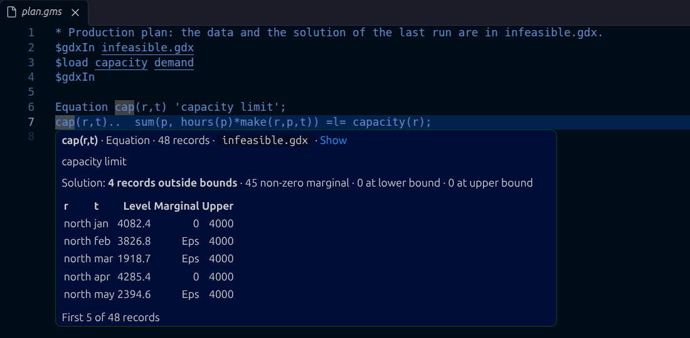
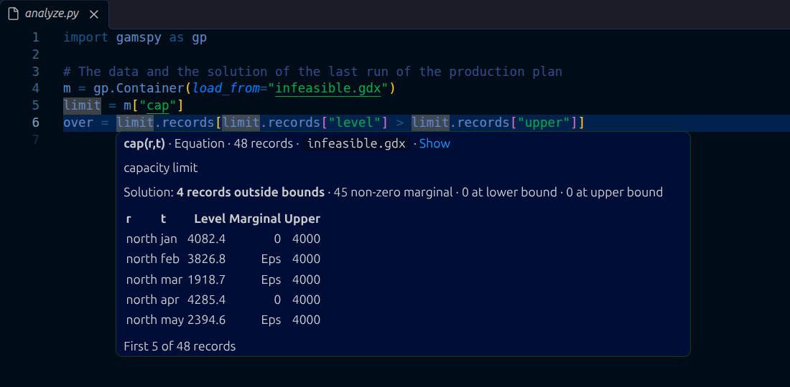

# GDX Analyzer

Browse, chart and compare [GAMS](https://www.gams.com) GDX files in Visual Studio Code.

GDX Analyzer opens `.gdx` files in a fast, read-only viewer, compares files as gdxdiff does, across scenarios and
with their Git history, links GAMS and Python code to the data, exports to Excel and Python, and gives AI agents
read-only access to model data and solutions. GDX files are read, compared as gdxdiff does, and written as gdxdump
text and CSV by the extension itself, so no GAMS installation is needed. See the [changelog](CHANGELOG.md) for what is new.

> GDX Analyzer is an independent project by Muhammet Soyturk. It is not affiliated with or endorsed by GAMS.

## Features

### Viewer

- **Symbol table** with entry, name, domain, type (e.g. *Positive Variable*, *Singleton Set*), dimension, records
  and explanatory text. Sort by any column, group by type, and search names or all columns. Entry `*` lists the
  unique elements of the file.
- **List and table views.** The table view arranges dimensions as rows and columns: drag them between the two, or
  swap them with ⇄. Variables and equations show level, marginal, bounds and scale.
- **Aggregation and totals.** Drag dimensions of the table view to *Aggregated* to combine their records with sum,
  mean, min, max or count, and add a total row and total columns with *Totals*. Columns without any value are left
  out of the table view.
- **Built for large symbols.** Records load while you scroll, so symbols with millions of records stay responsive.
- **Filters and search.** Filter labels from a checklist and numbers by range and special value. Search with
  wildcards, exact match or regular expressions, then jump between matches or show only matching rows.
- **Solution status.** For variables and equations, show only the records with a non-zero marginal (binding
  constraints), a level at its lower or upper bound, a level outside its bounds (infeasible), or a field that is not at
  its default. Each choice shows how many records it matches.
- **Exact numbers.** Values are read exactly. Choose the format per symbol (`g`, `f` or `e`, a precision, or full
  precision); sorting, filters and copies always use the exact values. A third click on the header of a number
  column sorts by magnitude, largest first.
- **Selection and copy.** Select cells, rows or columns and press Ctrl+C to paste them into Excel. The status bar
  shows the sum, average and count of the selection.
- **Files of other file systems,** such as Git revisions, open through a temporary copy.
- **Remembers your view** of every symbol (filters, sorting, layout, format, column widths) and reloads when the
  file changes, e.g. after a GAMS run.

### Solution report

**Solution Report** (in the viewer, the Explorer and the Command Palette) checks all variables and equations of a
solution at once, e.g. to find out why a model is infeasible or which constraints drive the solution:

- the **records outside their bounds**, farthest outside first, with their level, bounds and infeasibility,
- the **binding constraints** (equations with a non-zero or EPS marginal), largest |marginal| first,
- per symbol, the number of records outside their bounds, with a non-zero marginal and at their lower and upper
  bounds, with the largest infeasibility and |marginal|.

Click a record or a count to open the symbol with that solution status filter. The report is read again when the
file changes, e.g. after a GAMS run.

### Charts

Show the filtered records of a symbol as **bars**, **lines** or a **heatmap**. Pick the category dimension, the
series and the field; other dimensions are summed. Colors follow your theme and are colorblind-safe, and a
heatmap switches to a diverging scale when values have both signs. Save a chart as PNG or SVG, or copy it.

### Comparing files

**Two files.** Compare two files as gdxdiff does and review each differing symbol record by record: the values of both
files, their difference (Δ) and relative difference in percent (Δ%), and records that exist in only one file. Sort a
Δ or Δ% column by magnitude to see the largest changes first. Chart the differences, open a text diff of the gdxdump
output, or save the difference file. All gdxdiff options (tolerances, fields, symbols to compare or skip, and more)
can be set per comparison.

**Scenarios.** Compare one symbol across any number of GDX files, e.g. the results of several scenario runs: select
the files in the Explorer and choose **Compare Scenarios…** (or **Compare GDX Files** with more than two). The table
view shows the scenarios side by side with the difference (Δ) and relative difference (Δ%) from a base scenario you
choose; records missing in a scenario count as 0. Charts show a series per scenario, and filters, the solution
status, aggregation and totals work as in the viewer. The comparison is read again when a file changes.

**Git.** **Compare with Git Revision…** (in the Explorer and the viewer) compares a GDX file with its last commit,
its staged version or any commit of its history, or two of its revisions with each other. Clicking a
changed GDX file in Source Control shows both versions side by side in the viewer.

### GAMS and Python code

**Links.** GDX file names in `.gms` and Python files are links (Ctrl+click) that open the file in the viewer:
`$gdxIn data`, `execute_unload 'results.gdx', x;`, `gdx=out.gdx` on a `$call` line, or
`Container(load_from="data.gdx")` in GAMSPy. The symbols read or written by `$load`, `$unLoad`, `execute_load`,
`execute_unload` and similar statements are links to that symbol in the file, and so are, in GAMSPy and GAMS
Transfer code, the symbols of `read()`, `write()` and `loadRecordsFromGdx()` (`symbol_names=`, `symbols=` or a list
after the file) and `m["x"]` of a container read from a file. Put the cursor on any symbol name and
run **GDX: Show Symbol in GDX File** (also in the editor context menu) to open it in a GDX file the document
references. Relative names are looked up next to the document, then in the workspace folders.

**Hover previews.** Hover a GDX file name to see its symbols by type, or a symbol name to see a preview from the
file: its type, records and text, its first records, the minimum, maximum and sum of its values and, for variables
and equations, how many records are outside their bounds, binding and at their bounds. This works for the symbols
of `$load`, `execute_unload` and similar statements, and for any other name in a document that references GDX files
(the nearest reference before the name first). In Python, a name also previews the symbol it is bound to, e.g.
`limit` in `limit = Equation(m, name="supply")`, `cap = m.addParameter("a")` or `price = m["p"]`. In a notebook, the
GDX files read in other cells count too. Symbols with more than 200,000 records are previewed without them.

**Copy as Code.** Python code that reads a symbol into a pandas DataFrame with GAMS Transfer or GAMSPy and applies
the view: filters, solution status, sorting, shown fields and the table view (as `pivot_table`, with aggregation and
totals). Copy it or open it in a new editor.

### Export

- **Excel:** write any symbols to an `.xlsx` workbook, one sheet each, laid out like their view, with exact values.
  Optionally apply the filters and choose how special values are written. The same export can be saved as GAMS
  Connect instructions.
- **CSV** of one symbol, and the **gdxdump output** of a file or symbol as a text document.

### AI agents (MCP)

A built-in [MCP](https://modelcontextprotocol.io) server gives AI agents read-only access to GDX files. It is
available to agent mode in VS Code automatically. For Claude Code, Cursor and other agents, run
**GDX: Copy MCP Server Configuration for AI Agents…** and paste the result into their configuration.

| Tool | Description |
| --- | --- |
| `gdx_list_symbols` | The symbols of a file with type, dimension, domain, records and text |
| `gdx_read_symbol` | Records as CSV with exact values; filters (including solution status), search, sorting and paging |
| `gdx_symbol_stats` | Distinct labels per dimension; count, sum, mean, min, max and special values per field, optionally filtered |
| `gdx_compare` | The differing symbols of two files, or the differing records of one symbol with Δ and Δ%, sortable by magnitude |
| `gdx_compare_scenarios` | One symbol across several files, with Δ and Δ% from a base scenario; filters, sorting by magnitude and paging |
| `gdx_solution_report` | The solution status of all variables and equations: records outside their bounds, binding constraints, levels at bounds |

## Getting started

1. Install GDX Analyzer from the Visual Studio Marketplace.
2. Open a `.gdx` file: it opens in the viewer.
3. To compare two files, select both in the Explorer, right-click and choose **Compare GDX Files (gdxdiff)**.
   You can also use **Select for GDX Compare** and **Compare with Selected GDX**, or **Compare…** in the viewer.
4. To compare scenarios, select two or more files and choose **Compare Scenarios…**.

## Commands

All commands are in the Command Palette under **GDX**; the most common ones are also in the Explorer context
menu and the viewer.

| Command | Description |
| --- | --- |
| Open in GDX Analyzer | Open a GDX file in the viewer |
| Compare GDX Files (gdxdiff) | Compare two GDX files (more than two: as scenarios) |
| Compare Scenarios… | Compare a symbol across several GDX files |
| Compare with Git Revision… (gdxdiff) | Compare a GDX file with a version of it in Git, or two versions with each other |
| Show Symbol in GDX File | Open the symbol under the cursor in a GDX file the GAMS or Python document references |
| Show Solution Report | Records outside their bounds, binding constraints and levels at bounds of all variables and equations |
| Export to Excel… | Export symbols to an Excel workbook |
| Export Symbol to CSV | Save the records of a symbol as CSV |
| Dump to Text / Dump Symbol to Text | Open the gdxdump output of a file or symbol |
| Select Encoding of Labels… | Read labels and texts in another encoding (e.g. Latin-1) |
| Reset Viewer State | Forget the saved view of a file |
| Copy MCP Server Configuration for AI Agents… | Connect external AI agents |
| Show Tool Information | Show which gdxdump and gdxdiff are used |

## Settings

| Setting | Default | Description |
| --- | --- | --- |
| `gdxAnalyzer.useGamsTools` | `false` | Read, dump and compare GDX files with gdxdump and gdxdiff (of `gdxAnalyzer.backend`) instead of natively |
| `gdxAnalyzer.backend` | `auto` | gdxdump and gdxdiff to use (with `useGamsTools`): `gams` (a GAMS installation) or `gamspy` (the GAMSPy CLI); `auto` prefers GAMS |
| `gdxAnalyzer.gamsSystemDirectory` | | GAMS system directory for the `gams` backend (found automatically otherwise) |
| `gdxAnalyzer.gamspyExecutable` | | `gamspy` executable for the `gamspy` backend (found automatically otherwise) |
| `gdxAnalyzer.encoding` | `utf-8` | Encoding of labels and texts, e.g. `windows-1252` |
| `gdxAnalyzer.numberFormat.*` | `g`, 6 digits | Default number format: style, precision, full precision, trailing zeros |
| `gdxAnalyzer.squeezeDefaults` | `false` | Hide variable and equation fields that have their default value in every record |
| `gdxAnalyzer.rememberViewState` | `true` | Remember the view of each file after it is closed |
| `gdxAnalyzer.copy.decimalSeparator` | `period` | Decimal separator of copied numbers: `period`, `system` or `custom` |
| `gdxAnalyzer.links.enabled` | `true` | Links from GDX file and symbol names in GAMS and Python source to the viewer |
| `gdxAnalyzer.hover.enabled` | `true` | Previews of GDX files and symbols on hover in GAMS and Python source |
| `gdxAnalyzer.maxRowsPerPage` | `500` | Rows loaded at once while scrolling |
| `gdxAnalyzer.maxColumnsPerPage` | `100` | Columns per page in wide table views |
| `gdxAnalyzer.diff.*` | | Default comparison options (those of gdxdiff): tolerances, field, set texts, defaults, domains, UEL order |

## Requirements

- Visual Studio Code 1.101 or later.
- Any platform: GDX files are read, compared and dumped by the extension itself, so neither GAMS nor GAMSPy is
  needed. gdxdump and gdxdiff of a [GAMS](https://www.gams.com) installation or of
  [GAMSPy](https://gamspy.readthedocs.io) are only used with `gdxAnalyzer.useGamsTools`, and for GDX files the
  extension cannot read itself.

## Performance

GDX files are read natively, in chunks, straight into compact columns, and the viewer only renders the rows on
screen. Measured on an Intel Core i7-1260P with a 135 MB GDX file (Load with `gdxdump` in brackets):

| Symbol | Load | Memory | Sort | Label search | Table view |
| --- | --- | --- | --- | --- | --- |
| 1 million records (2 dimensions) | 0.06 s (0.3 s) | 22 MB | 0.3 s | 0.02 s | 0.07 s |
| 1 million variable records | 0.12 s (0.9 s) | 58 MB | 0.3 s | 0.04 s | 0.07 s |
| 10 million records (3 dimensions) | 0.4 s (3.8 s) | 250 MB | 5.2 s | 0.2 s | 0.6 s |

Comparing two files with 2 million differing records takes about 1.9 seconds (4 seconds with gdxdiff). Comparing 5
scenarios of a symbol with 1 million records each (5 million rows) takes 1.5 s and 310 MB for a parameter, and 1.9 s
and 580 MB for a variable; the table view, a sort by Δ and a chart then take 0.1–1.6 s.

## Limitations

- GDX files are read from a regular file system: files of other file systems (such as Git revisions) are viewed
  through a temporary copy; comparisons, GAMS Connect instructions and Copy as Code need files on disk. vscode.dev is
  not supported.
- The native reader reads GDX file formats 5 to 7, compressed or not, written with little-endian byte order (all
  current platforms); other files are read and compared with gdxdump and gdxdiff, if available.
- Sums of relative differences (Δ%) and of the bounds and scale of variables and equations are left empty in
  aggregated cells and totals; mean, min, max and count are shown.
- With the `gamspy` backend, file names must end in lower-case `.gdx`.
- Copying is limited to 5 million cells, and the Excel export to Excel's sheet size (1,048,576 rows, 16,384
  columns). Filter larger symbols first.

## Contributing

See [CONTRIBUTING.md](CONTRIBUTING.md) for building, testing and packaging the extension, and
[THIRD_PARTY_NOTICES.md](THIRD_PARTY_NOTICES.md) for the license of the GDX library, whose file format and tools the
extension follows.
